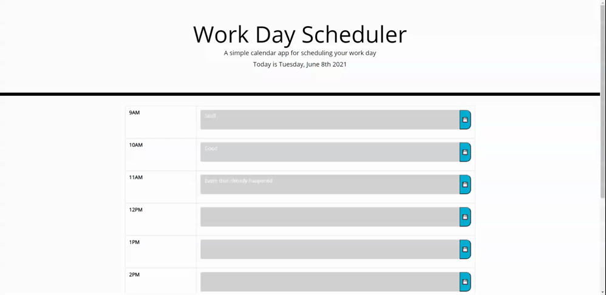

# WorkDayScheduler
## Project Summary
This project project is for a Work Day Scheduler. It can be used for work, for planning activities or even for home schooling. It will show you what events are upcoming, which have transpired and which are happening now through color coding. 
_________________________________________________________________________________________________________________________________________________________________________
## Project Description
Work Day Scheduler is a simple that allows the user to input events per hour time blocks. Hours covered are 9am to 6pm. These can be modified in the code. The default times usually correspond with normal work day. The user clicks in a box and then types in an input. When finished, they will need to click on the floppy for the text to be saved to the local storage. Values can be seen in the console under Application and Local storage. Each key corresponds to time (in 24hr format) and has the corresponding event saved to it. Upon reloading the page, closing and then returning the page, the values for each hour timeblock will be loaded into their respective hours they were orginally savedt to. They may be overwritten or deleted, the new values just need to be resaved to overwrite what is in local storage. 

As the day progresses, the colors of the time blocks will change color. Grey signifies the hour timeblock has passed. Green means the event is in the future. Red references that the event is currently in progress. Functionality of the web app can be seen below.

## Project Process
I began this project with some starter code. I began by choosing what looked most similar to the mock-up, mainly the table from bootstrap. From there I began working on the javascript, but attempting and learning to use JQUERY methods and punctuation. I was most used to vanilla javascript, so I when I began looking for ideas on how save and load items to storage, I used an old example To-DO list from previous week. It was using javascript though so I needed to try to change it to JQUERY. I spent many hours trying to make it work, but was stuck. I began looking across the internet was able to find a possible version of what I needed. It was the .each method. This greatly simplified the process and even the code. It was meant I did not really need a for loop or extra variables. Through the use of the .each method, I was able to have the code look at each timeblock and save what was written, later load what previously saved and then finally checking time using moment(). This saved me a lot of time. 

I was able to get the code to work, so next I went to look at the style, which had been pre-provided for the exercise. I just had to tie to the correct sections. Most were pretty self-explanatory. The hardest one to tie to the style sheet was textarea. I replaced all 'input' with it and it worked for the most part. It does not look exactly like the mock-up, but it does look close enough, but more importantly, it meets the functionality of the Acceptance criteria.

## Project Link
https://pricosaint.github.io/WorkDayScheduler/

## Project Screenshot/Functionality
